# Real-time Collaborative Todo List REST API 🤝✅

Todo list REST API designed for real-time collaboration and offline/disconnected clients using DDD/CQRS/Event Sourcing concepts

## Important Links

| Name | Url |
| ---- | --- |
| Production| https://sf-todo.azurewebsites.net |
| Swagger | https://sf-todo.azurewebsites.net/swagger/index.html |
| Postman Todo API Collection file | https://github.com/stktung/SleekFlow.Todo/blob/master/Todo%20API.postman_collection.json |
| Postman Todo Data Setup Collection file | https://github.com/stktung/SleekFlow.Todo/blob/master/Todo%20Data%20Setup.postman_collection.json |
| Postman Production Environment file | https://github.com/stktung/SleekFlow.Todo/blob/master/postman_environment.json |

## Contents
- [Highlights](https://github.com/stktung/SleekFlow.Todo#highlights)
- [Development Instructions](https://github.com/stktung/SleekFlow.Todo#development-instructions)
- [Use Case Overview](https://github.com/stktung/SleekFlow.Todo#use-case-overview)
- [Architectural Overview](https://github.com/stktung/SleekFlow.Todo#use-case-overview)
- [DevOps CI/CD Process](https://github.com/stktung/SleekFlow.Todo#use-case-overview)

# Highlights

### System Highlight

- Real Time Collaboration
- Offline/Disconnected Client 📱
- Update Conflict and Merging
- Event Sourcing
- CQRS (Separate Read/Write Models and Database)

### Functional Highlight

- Todo Domain Model
    - Name
    - Description
    - Due Date
    - Completion Status
- REST APIs (See Swagger documentation for more details)

| Function | API | Remarks 
| -------- | --- | ------- |
| Get Todo | `GET /Todo/{id}` |
| Get Todo List with Filter/Sort | `GET /Todo?isCompleted=true&dueDateIsAfter=2022-11-01&dueDateIsBefore=2022-11-10&sortByField=dueDate&sortByAsc=true` |
| Get Todo History | `GET /Todo/{id}/history` | To support merge and conflict on client |
| Create Empty Todo | `POST /Todo/create` |  
| Insert Text into Todo Name | `POST /Todo/{id}/name/inserttext` | Insert piece of text to any character position in the Todo's name 
| Delete Text from Todo Name | `POST /Todo/{id}/name/deletetext` | Delete piece of text of a certain length from a character position in the Todo's name 
| Insert Text into Todo Description | `POST /Todo/{id}/description/inserttext` | Insert piece of text to any character position in the Todo's description 
| Delete Text from Todo Description | `POST /Todo/{id}/description/deletetext` | Delete piece of text of a certain length from a character position in the Todo's description 
| Update Due Date | `PUT /Todo/{id}/duedate` |  
| Update Completion Status | `PUT /Todo/{id}/completed` |  

### Development Highlight

- Docker
- Github action for CI/CD
    - Deploys to Azure App Service when new commit is pushed to master 
- Hosted on Azure App Service (free tier, so it might be a bit slow 😂)
- NUnit Integration Tests
- Swagger
- Automapper
- Dapper Micro ORM
- Embedded/In-memory EventStoreDB (Write DB)
- Event Pub/Sub via EventStoreDB 
    - Subscription Handler Implemented as a `BackgroundService`
- Embedded/In-memory Sqlite (Read DB)
- Postman Collections:
    - API
    - Sample Data Setup
- Dependency Injection
- Middleware Error Handler

### Wishlist (Not Implemented) 🌈
- Swagger detailed documentation
- Authentication/Authorization
- SignalR/WebSocket endpoint for pub/sub with client
- Automation testing with Github Action
- Support for Todo attributes 

# Test/Development Instructions

## Postman

### Test Instructions
1. Load all three postman files (see link above)
2. Run the entire `Todo Data Setup` collection to setup some initial data
3. Run any API in `Todo API` collection to test

### Variables

| Variable | Remarks | When is it updated |
| -------- | ------- | ------------------ |
| Host | Url of the host. This is by default the production URL | Never |
| Id | This is used in many GET/POST/PUT APIs | Whenever `Create a Todo` is executed, this becomes the new Todo's Id |
| ExpectedVersion | This is used by all POST/PUT APIs to support merge/conflict resolution | After any successful (OK 200) POST/PUT call, this is incremented by one | 

## Development Instructions

### Requirements
- .NET 6 SDK
- Visual Studio 2022
- Docker Desktop 4.13

### ⚠ First Time Setup ⚠
#### Add environment variables for in-memory EventStoreDB connection
1. Open solution from Visual Studio
2. Click `Debug` menu and click `SleekFlow.Todo.Application Debug Properties` 

3. Click `Docker` and under `Environment variables` add the following content:

`EVENTSTORE_USERNAME=admin,EVENTSTORE_PASSWORD=changeit`

### Build
1. Open solution with Visual Studio
2. Hit F5
3. Swagger will show up

# Use Case Overview

## Create Empty Todo

Before user can do anything, an empty Todo has to be created via the API. Internally, API will persist this and return `id`, and `version` to user. These are important to user for any future action.

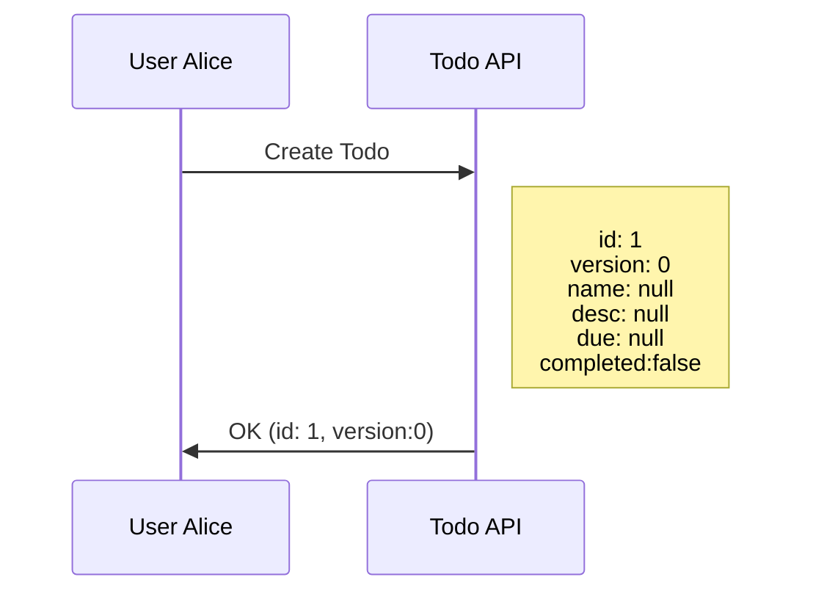

## Enter Todo Name

With the `id`, and `version`, user can update the name by calling the `Insert Text To Name` API where the text to insert and where to insert. In this case since the todo is empty, `position = 0` is used (i.e. start of name)

> ℹ **NOTE**: `Version` is incremented for each successful update to the Todo.

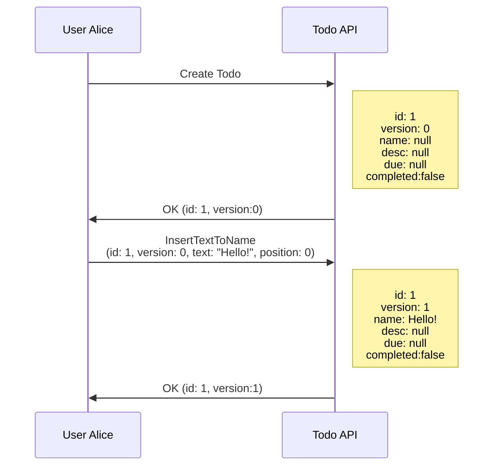

To update the name, Alice has to call `Insert Text To Name` API again and insert the new piece of text into the existing Name. In this case, we want to insert `World` into `Hello!` to form `Hello World!`

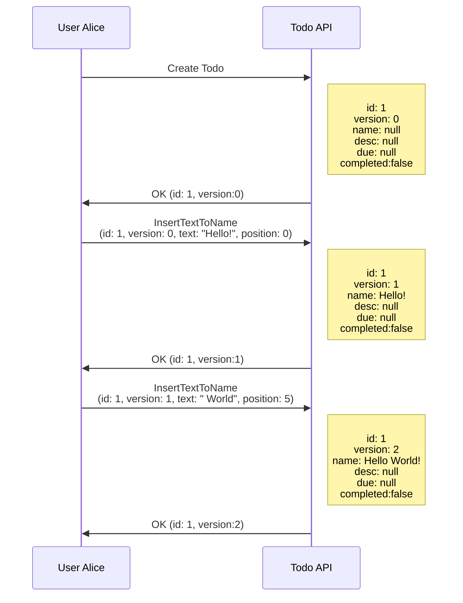

## Real-time Collaboration with Other Users

Let's say at this time another user, Bob, enters the same Todo editing session as Alice. He first gets the latest version of it. 

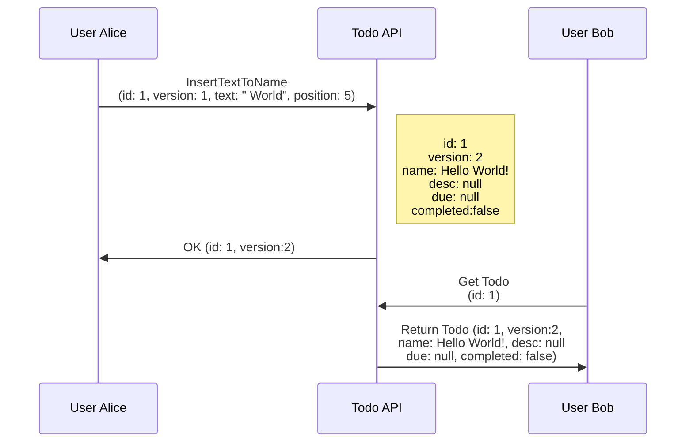

If both Alice and Bob updates the name at the same time, only one will win the race condition. The other will receive a `Version Mismatch` error:

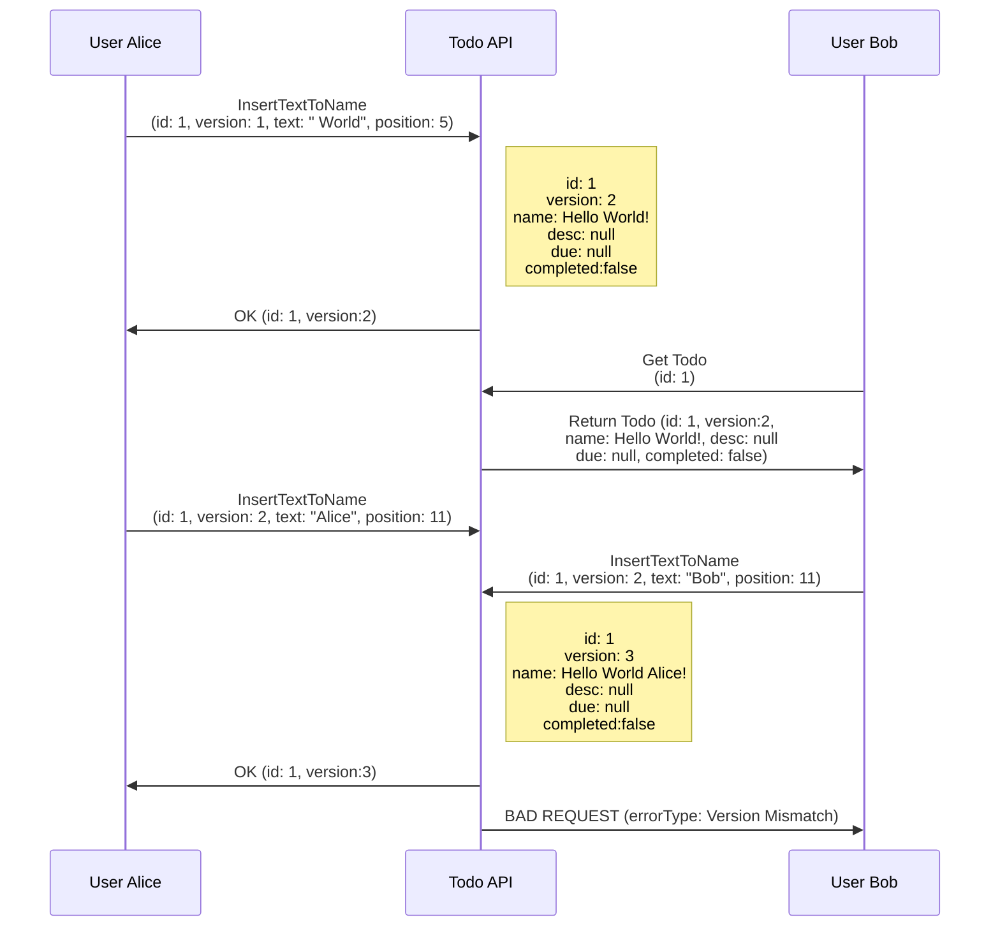

> ℹ **NOTE**: API returns this error because by the time Bob's request tries to write to the database, the version in storage is already at version 3. Bob's request expects version is at 2 and so the `Version Mismatch` error is returned.

Bob's client has a few ways to handle this error. One way is to get the latest updates from the API and merge or resolve the conflict on the client and re-call the `Insert Text To Name` API:

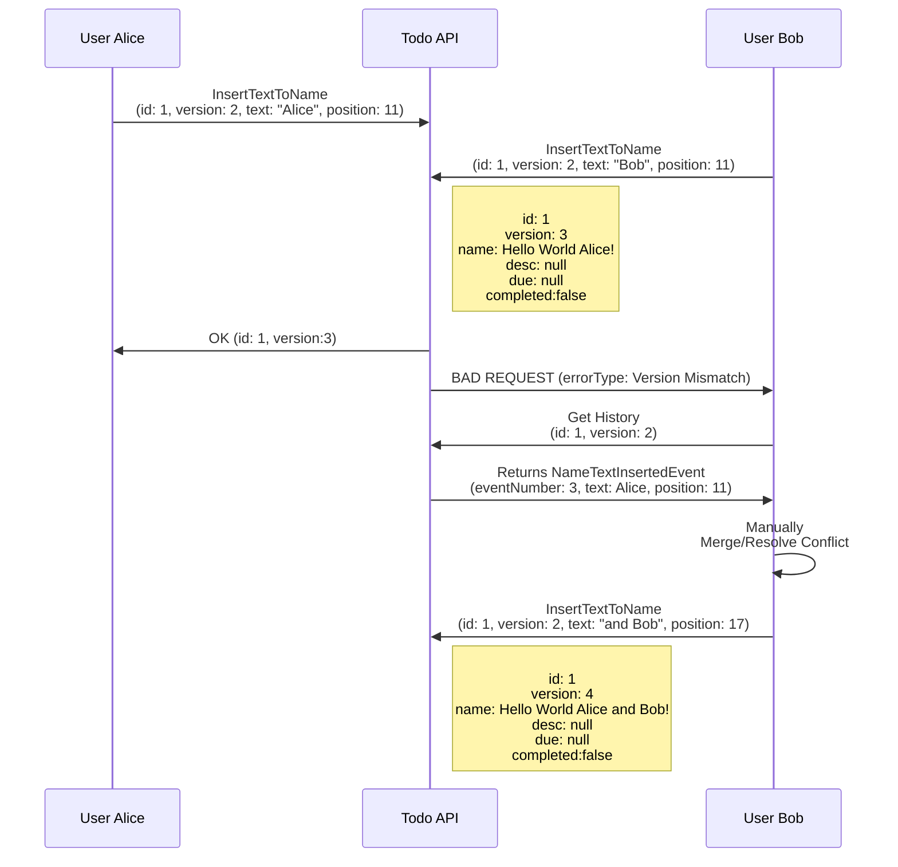
> ℹ **NOTE**: A way for your client to merge/resolve the conflict is automatically merge the inserted text from other users onto your local version. This is similar to how git merges. 
> 
> A less complicated way is to just refresh and discard changes you made and get the latest from the API again. The UX for this is less desirable though. 

>  ℹ **NOTE**: To reduce the chance of conflict, it'll be great if the client can automatically pull the latest events from the API asap. One of the best ways will be to implement a Web Socket client to listen to Todo events published from the API. Another way is for the client to poll the API at a regular interval.
>
> The web socket way probably gives better UX but may be little more complicated and costly to write. 

## Occasionally Disconnected/Offline Clients

Due to inconsistent WIFI and network availability, devices like mobile phones/IoT devices can sometimes be disconnected or be offline. Using merge/conflict resolution strategies above can allow a offline client to make changes locally on their own device and ignore any potential conflicts.

Once the device reconnects, new events can be merged to the client and the sent to the API for a big update. An event sourced based architecture can help implement such feature.

# Architectural Overview

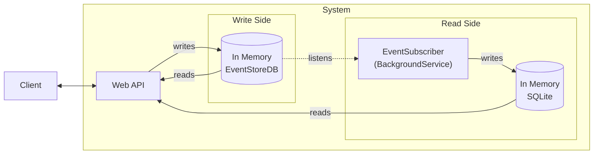

| Component | Remarks |
| --------- | ------- |
| Web API | Handles web requests performs domain validation, writes to EventStoreDB and reads from SQLite |
| EventStoreDB | Event sourcing DB used as the write DB for all events |
| EventSubscriber | Listens to EventStoreDB and projects events to a SQL table in SQLite for reading |
| SQLite | Stores projections for read purpoe from events that can be filtered/sorted | 

## Web API

Handles web requests from client, performs domain logic validation and saves event to EventStoreDB.

### Overview

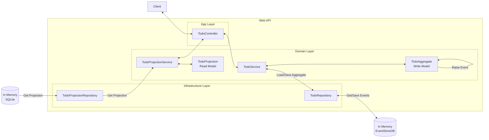

| Component | Remarks |
| --------- | ------- |
| TodoController | Handles web requests and model translation between domain and application layer |
| TodoService | Coordinates write-side functions between application and infrastructure layer. May handle domain logic that doesn't require transactional consistency. |
| TodoAggregate | Handles all domain logic and validation that requires transactional consistency. Events are raised here. |
| TodoRepository | Writes events to EventStoreDB |
| TodoProjectionService | Coordinates read-side functions between application and infrastructure layer. |
| TodoProjection | Read model that contains all properties in Todo required for viewing for user |
| TodoProjectionRepository | Reads projections from SQLite DB |

### Typical Write Operation Flow

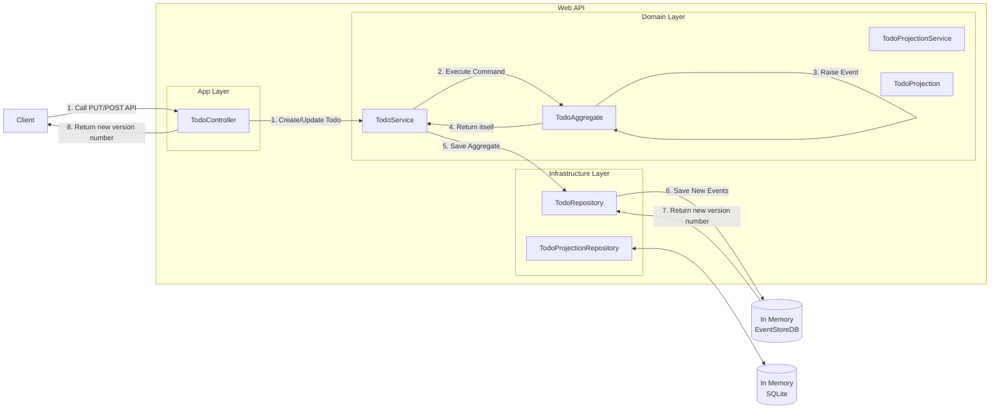

### Typical Read Operation Flow

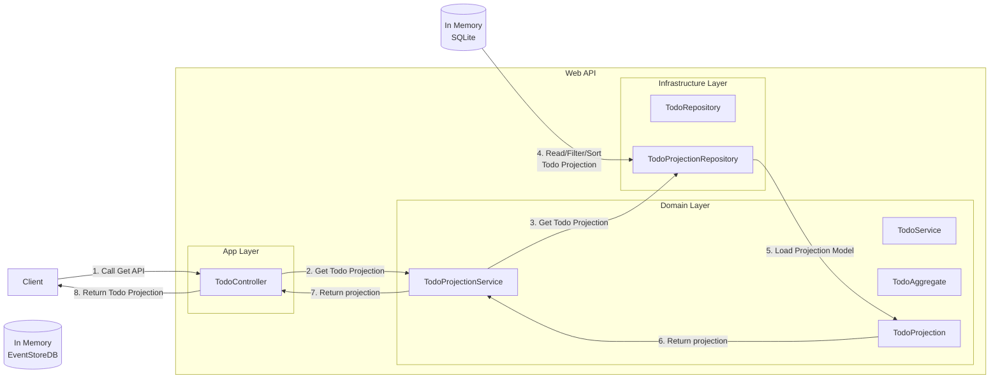

## EventStoreDB

EventStoreDB has multiple event streams, one for each unique Todo. Within each stream contains all events recorded for each todo ordered by event number.

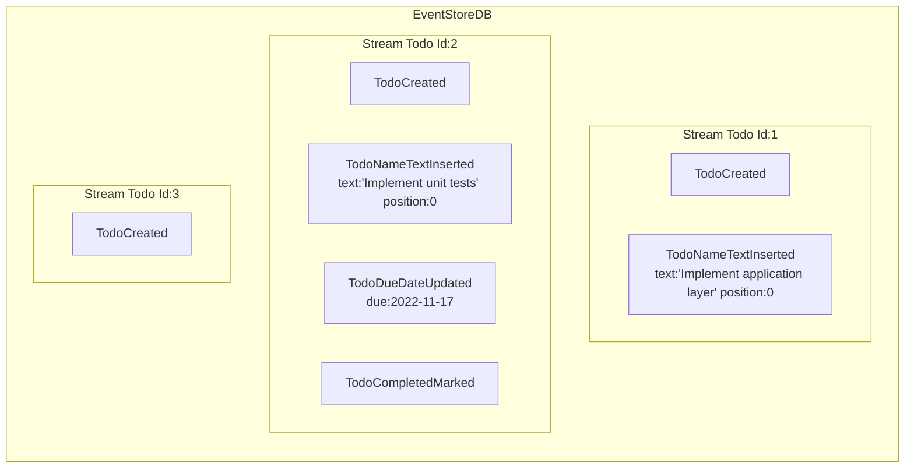

The following events are supported:

| Event Type | Properties |
| ---------- | ---------- |
| TodoCreated | n/a|
| TodoNameTextInserted| `string` Text, `int` Position |
| TodoNameTextDeleted| `int` Position, `int` Length |
| TodoDescriptionTextInserted| `string` Text, `int` Position |
| TodoDescriptionTextDeleted| `int` Position, `int` Length |
| TodoDueDateUpdated | `DateTime` DueDate |
| TodoCompletedMarked | n/a |
| TodoCompletedUnmarked | n/a |

## EventSubscriber
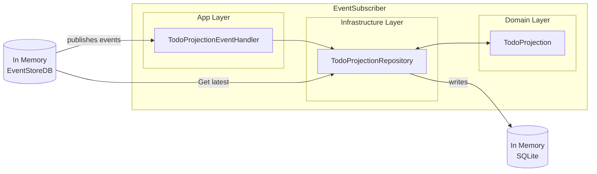

| Component | Remarks |
| --------- | ------- |
| TodoProjectionEventHandler | Listens for events published from EventStoreDB and coordinates with repository to save it as projection|
| TodoProjectionRepository | Loads projection from latest events and saves it into SQLite |
| TodoProjection | Read model that represents a Todo |

### Typical Projection Update Flow

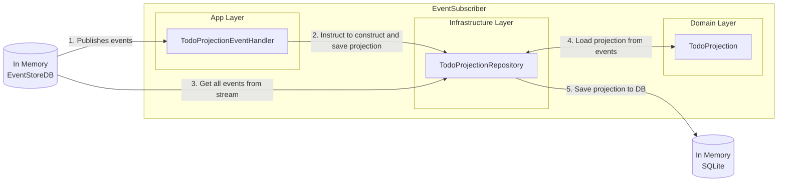

> ℹ **NOTE**: Since events can go missing and arrival order is **not guaranteed**, `TodoProjectionRepository` always reads ALL events from EventStoreDB before constructing projection. This is a simple trick to make sure we don't have to think to much about missing messages or message ordering.

## Aggregate state diagram

`TodoAggregate` manages the state and enforces domain validation logic. In short, any change can be made while the Todo is `incomplete`. But when it's `complete` nothing can be changed unless it is marked as `incomplete` again. See below: 

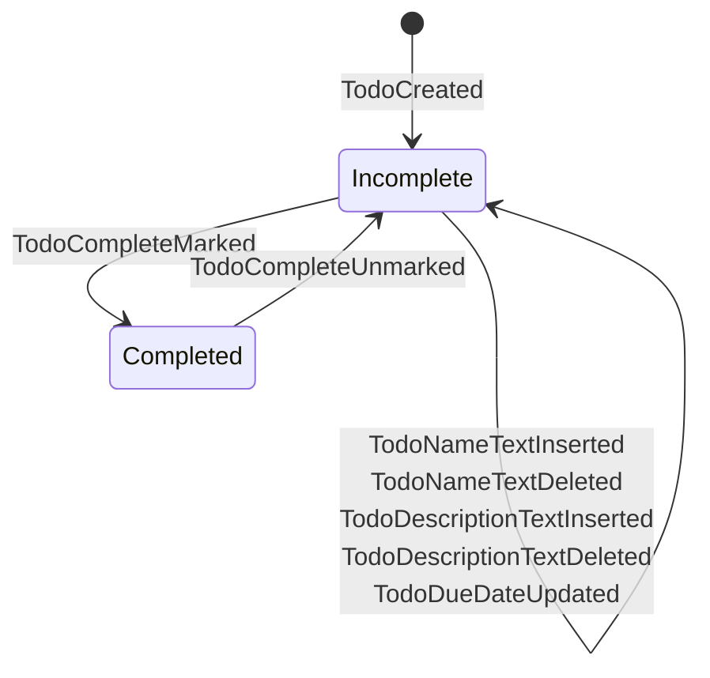

# Github Action CI/CD Process

Github action workflow: https://github.com/stktung/SleekFlow.Todo/blob/master/.github/workflows/azure-container-webapp.yml

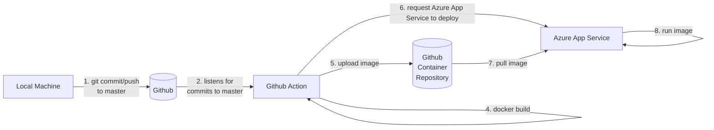
